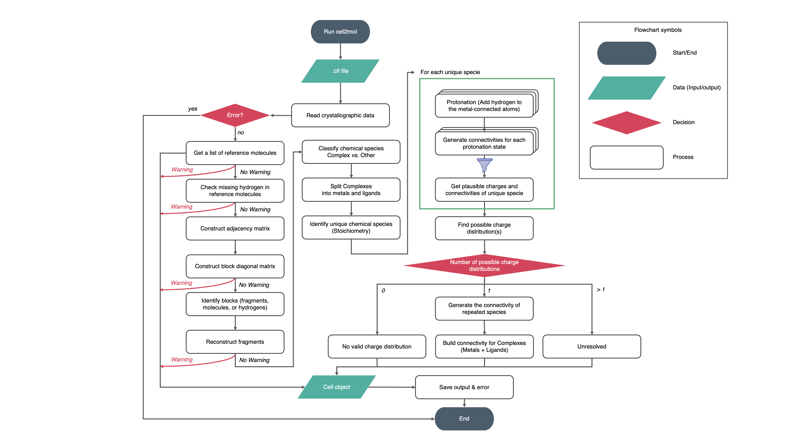

cell2mol: Unit Cell to Molecule Interpretation
==============================================


[](https://zenodo.org/doi/10.5281/zenodo.10204037)

## Contents
* [About](#about-)
* [Citation](#citation-)
* [Install](#install-)
* [Examples](#examples-)
* [Errors](#errors-)

## About [↑](#about)

Program that interprets .cif files of molecular crystals and retrieves structural, connectivity and charge information of all molecules present in the unit cell. This includes (but is not limited to):

- Atomic coordinates, labels
- Total molecular charge, and formal atomic charges, including metal oxidation states
- Connectivity network as defined by either the adjacency matrix or the bond-order matrix 

The program generates a so-called "cell" object, with hierarchical information on the unit cell. "Cells" have "Molecules". Molecules that hold a transition metal are considered a "Complex". Complexes are made of "Ligands" and "Metals". "Ligands" are made of "Groups" of connected "Atoms". 

"Complexes", "Ligands", "Metals" and "Groups" host the information of their constituent "Atoms". That way, cell2mol provides a very in-depth interpretation of unit cells, which can be particularly useful to generate controlled databases for Quantum Chemistry and Machine Learning applications. 

The code runs on pure python with minimal dependencies: 
- `numpy`
- `scipy`
- `pandas`
- `networkx`
- `RDkit` 

For portability, we provide an exemplary conda environment in `environment.yml` which can be used to construct a conda environment with all necessary dependencies by running:

`conda env create -f environment.yml`

Afterwards, the created environment can be activated and the following steps should proceed smoothly. We also provide a `requirements.txt` file that should streamline virtual environment creation with pip, if desired.

## Citation [↑](#citation)

If you use cell2mol, please cite:

```
Vela, S., Laplaza, R., Cho, Y. et al. cell2mol: encoding chemistry to interpret crystallographic data. npj Comput Mater 8, 188 (2022). https://doi.org/10.1038/s41524-022-00874-9
```

## Install [↑](#install)

Download and add c2m_driver.py to your path. No strings attached. Run as:

```python
python c2m_driver.py [-h] -i FILENAME [-s STEP]
```

You can also execute:

```python 
python setup.py install
```

to install cell2mol as a python module. Afterwards, you can call cell2mol as:

```python 
python -m cell2mol [-h] -i FILENAME [-s STEP]
```

which is the recommended way. Options can be consulted using the `-h` flag in either case.

## Examples [↑](#examples)

The test/infodata subdirectory contains a copious amount of tests which double as examples. Any of the .cif files can be run as:

```python
python -m cell2mol -i [FILENAME]
```

An output file will be created locally. Additionally, a .gmol file containing the analyzed unit cell will be written by cell2mol. The cell object contains all the information following the class specifications, and can be loaded using the pickle library for further usage.

As a reference, cell2mol characterizes the crystal structure of "YOXKUS" (available in the test/infodata directory) as follows: YOXKUS has 4 Re complexes and no counterion or solvent molecules. Each complex has 3 types of ligands. The first ligand bears a -1 charge, and is connected to the Re ion through two groups of atoms. The first group consists of a substituted Cp ring with η5 hapticity, and the other is the P atom of a diphenylphosphine, with κ1 denticity. The second ligand is an iodine atom with -1 charge, and appears twice. The third is a neutral CO ligand, with a -1 and a +1 formal charge in the C and O atoms, respectively, and a triple bond between them.

A flowchart of the entire process is given below:



## Known errors [↑](#errors)

Few chemical patterns tend to be poorly interpreted by cell2mol, because of inconsistencies in either cell2mol itself, or in xyz2mol.

cell2mol determines the bond order between atoms based on their connectivity, typical atomic valence electrons of the atoms involved, and the most plausible total charge of the molecule. cell2mol is inevitably incorrect if there is an extra electron or radical chemical species. Other known ligands with wrong interpretations are the triiodide (I<sub>3</sub><sup>-</sup>), and azide (N<sub>3</sub><sup>-</sup>) ions. Future development of cell2mol will aim a fixing those errors. If users identify other common misinterpretations, please contact the authors. 


---
